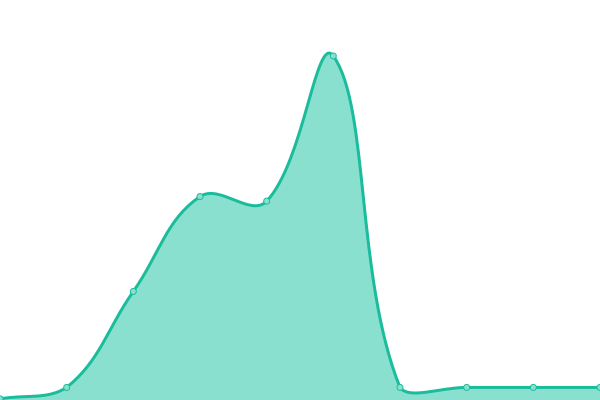

# [📈 Live Status](https://status.xhy.ch): <!--live status--> **🟩 All systems operational**

This repository contains the open-source uptime monitor and status page for [Haoyu Xu](xhy.ch), powered by [Upptime](https://github.com/upptime/upptime).

With [Upptime](https://upptime.js.org), you can get your own unlimited and free uptime monitor and status page, powered entirely by a GitHub repository. We use [Issues](https://github.com/halyul/upptime/issues) as incident reports, [Actions](https://github.com/halyul/upptime/actions) as uptime monitors, and [Pages](https://status.xhy.ch) for the status page.

<!--start: status pages-->
<!-- This summary is generated by Upptime (https://github.com/upptime/upptime) -->
<!-- Do not edit this manually, your changes will be overwritten -->
<!-- prettier-ignore -->
| URL | Status | History | Response Time | Uptime |
| --- | ------ | ------- | ------------- | ------ |
|  Server Eagle | 🟩 Up | [server-eagle.yml](https://github.com/Halyul/upptime/commits/HEAD/history/server-eagle.yml) | 

 666ms
     
 | 

<a href="https://status.xhy.ch/history/server-eagle">98.38%</a>
    

|  Server Eagle 1 | 🟩 Up | [server-eagle-1.yml](https://github.com/Halyul/upptime/commits/HEAD/history/server-eagle-1.yml) | 

 115ms
     
 | 

<a href="https://status.xhy.ch/history/server-eagle-1">50.84%</a>
    

|  Server Goose | 🟩 Up | [server-goose.yml](https://github.com/Halyul/upptime/commits/HEAD/history/server-goose.yml) | 

 414ms
     
 | 

<a href="https://status.xhy.ch/history/server-goose">100.00%</a>
    

|  Server Cat | 🟩 Up | [server-cat.yml](https://github.com/Halyul/upptime/commits/HEAD/history/server-cat.yml) | 

 586ms
     
 | 

<a href="https://status.xhy.ch/history/server-cat">97.42%</a>
    

<!--end: status pages-->

[**Visit our status website →**](https://status.xhy.ch)

## 📄 License

- Powered by: [Upptime](https://github.com/upptime/upptime)
- Code: [MIT](./LICENSE) © [Haoyu Xu](xhy.ch)
- Data in the `./history` directory: [Open Database License](https://opendatacommons.org/licenses/odbl/1-0/)
